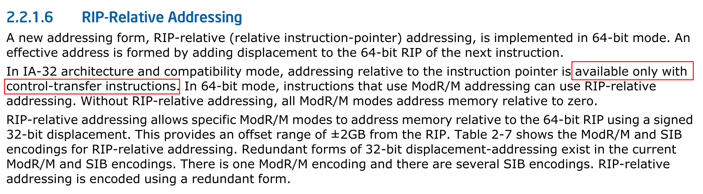
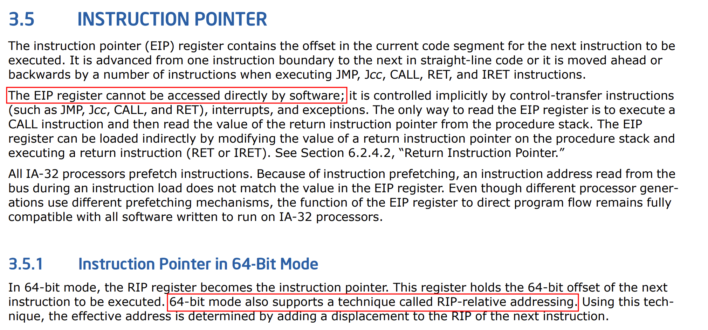

## Spawning a shell via execve 

### /usr/bin/sh vs /bin/sh

I was a bit surprised, because although the path for shell is actually `/usr/bin/sh`,
passing `/bin/sh` would spawn a shell as well.

```bash 
$ which sh
/usr/bin/sh
```

[stackoverflow](https://unix.stackexchange.com/questions/5915/difference-between-bin-and-usr-bin) has some explanations on `/bin` vs `/usr/bin`.

On Ubuntu-24.04.4 `/bin` is a symbolic link to `/usr/bin`.

```bash 
$ file /bin
/bin: symbolic link to usr/bin
```

Long story short, `/bin` is now merged to `/usr/bin` because unlike the past when `/bin` had the purpose to contain the utilities to mount `/usr`, nowadays initramfs supersedes it. 

[fedora project](https://fedoraproject.org/wiki/Features/UsrMove) has explained the background on why `/bin` and `/usr/bin` was merged. 

If it's a bit complicated, [here](https://qmacro.org/blog/posts/2020/08/16/why-we-have-bin-and-usr-bin/) is a more concise post on the topic. 

### What is dash?

Now I became a bit curious because `/usr/bin/sh` is a symbolic link to dash. 

```bash 
$ ls -al /usr/bin/sh
lrwxrwxrwx 1 root root 4 Mar 31  2024 /usr/bin/sh -> dash
```

But what is dash? 

Is it faster version of `/usr/bin/sh` because it runs fast? 

That was just a bad joke. 

[Dash](https://en.wikipedia.org/wiki/Almquist_shell) (Debian Almquist shell) is an `ash` shell ported by Herbert Xu from NETBSD to Debian. 

Almquist shell aka `ash` was a lightweight Unix shell written by Kenneth Almquist. 

The binary size for Bash became huge over the years so Debian/Ubuntu decided to switch from bash to dash in order to speed things up. 

[stackoverflow](https://serverfault.com/questions/193293/what-is-bin-dash) has a post on the topic. 

According to [ubuntu wiki](https://wiki.ubuntu.com/DashAsBinSh) Ubuntu's default sytem shell has changed from bash to dash since Ubuntu 8.04 LTS which is quite a long time ago. 

You can check the difference in file sizes between bash and dash.

```bash
$ ls -al /usr/bin/dash /usr/bin/bash 
-rwxr-xr-x 1 root root 1446024 Mar 31  2024 /usr/bin/bash
-rwxr-xr-x 1 root root  129784 Mar 31  2024 /usr/bin/dash
```

Bash is at least 10 times bigger than dash. 

### execve syscall 

One thing I've learned is that when calling `execve` or the `exec` family syscalls you need to terminate `argc`, `argv` and `envp` in a NULL character. 

```c
#include <unistd.h> 

int main(){
    char *args[2];
    args[0]="/usr/bin/sh";
    args[1]=NULL;
    execve(args[0],args,NULL);
}
```

[stackoverflow](https://unix.stackexchange.com/questions/739766/exec-system-call-in-linux) has an explanation on why the arrays all have to terminate with a NULL character. 

Just keep in mind that you need to pass NULL and not the string "NULL". 

### 64bit vs 32bit 

Writing a 32bit version of `execve("/bin/sh",0,0)` was quite hard. 

This was my first attempt at it.

```bash 
$ cat execve.s 
.intel_syntax noprefix 
.globl _start 

_start:
    lea edi, [eip+bin_sh]
    mov esi, 0 
    mov edx, 0
    mov eax, 59 
    int 0x80 
bin_sh:
.string "/bin/sh"
```

I tried compiling the assembly with gcc but the compilation failed.

```bash 
gcc -nostdlib -static -m32 execve.s -o execve32
execve.s: Assembler messages:
execve.s:5: Error: invalid operands (*UND* and .text sections) for `+'
```

Initially, since x86-64 can run x86 in compatibility mode I thought I could just use a smaller register and execute int 0x80 instead of syscall. 

Swapping the r prefix to e and switching syscall to int 0x80 will not work. 

That's because there's a couple of differences between x86-64 and x86.

Unlike x86-64 which supports RIP-relative addressing, x86 doesn't. 





As a result, the following instruction is invalid in x86. 

```
lea edi, [eip+bin_sh]
```

Second, the abi is completely different. 

[stackoverflow](https://stackoverflow.com/questions/2535989/what-are-the-calling-conventions-for-unix-linux-system-calls-and-user-space-f) has a post related on the calling conventions for x86. 

As you can see from [/arch/x86/entry/enry_32.S](https://elixir.bootlin.com/linux/v7.1/source/arch/x86/entry/entry_32.S#L776) the calling conventions for x86 is completely different from x86-64.

```c
 * Arguments:
 * eax  system call number
 * ebx  arg1
 * ecx  arg2
 * edx  arg3
 * esi  arg4
 * edi  arg5
 * ebp  user stack
 * 0(%ebp) arg6
 */
```

Unlike what I expected the first, second, third arguments aren't passed via edi, esi and edx. 

Another interesting point is that the syscall numbers are completely different between x86 and x86-64 as well. 

[stackoverflow](https://unix.stackexchange.com/questions/338650/why-are-linux-system-call-numbers-in-x86-and-x86-64-different) references an [lkml](https://lkml.iu.edu/hypermail/linux/kernel/0104.0/0547.html) post and that the syscalls were renumbered to optimize it at the cahceline usage level. 

The syscall numbers is located at [arch/x86/entry/syscalls/syscall_32.tbl](https://elixir.bootlin.com/linux/v7.1/source/arch/x86/entry/syscalls/syscall_32.tbl) and [arch/x86/entry/syscalls/syscall_64.tbl](https://elixir.bootlin.com/linux/v7.1/source/arch/x86/entry/syscalls/syscall_64.tbl).

The execve syscall number for x86 is 11, while for x86-64 it's 59. 

```
11	i386	execve			sys_execve			compat_sys_execve
59	64	execve			sys_execve
```

Now take a look at the 32bit version of `execve("/bin/sh",0,0)`. 

```
.intel_syntax noprefix 
.globl _start 

_start:
    xor ecx, ecx 
    push 0xb 
    pop eax 
    push ecx 
    push 0x68732f2f # b'//sh'
    push 0x6e69622f # b'/bin'
    mov ebx, esp 
    int 0x80
```    

The code initiates by setting ecx to 0 by xoring itself.

Then eax needs to hold the syscall number, which would be 11 (execve) in this case. 

Unlike x86-64, x86 uses the stack primarily to save values via push/pop. 

By pushing 0xb(11) and popping it into eax, eax now holds the syscall number for execve. 

Then it pushes ecx which is now zero from the previous xor. 

ecx corresponds to the third argument, which needs to be zero for `execve("/bin/sh",0,0)`.

The final step is to push '/bin/sh' on the stack. 

Since, '/bin/sh' is 7 letters and we can push only 4 letters or bytes at once in x86, we need to pad `/sh` so it becomes 4 bytes. 

since `/` is equivalent to `//` we can pass `//sh` instead of `/sh` to fit 4 bytes. 

Check out [why](https://askubuntu.com/questions/274510/what-does-mean-in-a-path) `/` is equivalent to `//`.

After splitting `/bin/sh` and pushing them onto the stack, the last step is to set ebx point `/bin/sh`.

And finally, `int 0x80` will trigger the syscall. 

[Here's](https://stackoverflow.com/questions/1817577/what-does-int-0x80-mean-in-assembly-code) a pretty detailed explanation on what `int 0x80` does. 

That's a wrap for the 32bit syscall, but I wonder why the assembly source doesn't `xor edx, edx` because most of the time the third argument which handles `envp` needs to be NULL terminated. 

BTW I got the 32bit syscall from [here](https://www.exploit-db.com/exploits/46809) although, [this](https://www.exploit-db.com/exploits/39160) one seems a bit better because it purposely sets edx to 0.

I slightly modified the assembly, so it uses `xor ecx, ecx` to zero out ecx.

```bash 
$ cat execve32-2.s 
.intel_syntax noprefix 
.globl _start

_start:
    push 0xb 
    pop eax 
    xor esi, esi
    push esi
    push 0x68732f2f # b'//sh'
    push 0x6e69622f # b'/bin'
    mov ebx, esp 
    xor ecx, ecx
    xor edx, edx 
    int 0x80
```

A lot of hackers refer to assembly snippets like these that spawn a shell as [shellcode](https://en.wikipedia.org/wiki/Shellcode). 

Don't forget to pass the `-m32` to create 32 bit shellcode. 

I usually compile with gcc's `-nostdlib` and `-static` because it gets rid of all the complex loader code that gets injected into the ELF. 

On top of that pwn.college me taught me to compile shellcode in the following manner.