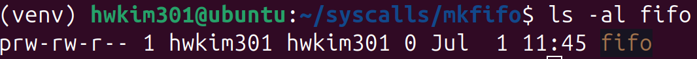

## What are FIFOs? 

[FIFO](https://en.wikipedia.org/wiki/Named_pipe)s (First In First Out) aka named pipes are similar to named pipes. 

Unlike unnamed pipes, FIFOs allow unrelated processes to exchange data. 

Creating a fifo can be done by using the `mkfifo` command. 

```bash 
mkfifo fifo 
```

Running `ls -al` on the fifo tells you that it's a pipe. 



The color highlighting for the file is also quite different as well.

Opening a FIFO for reading blocks until another process opens the FIFO to write. 

FIFOs will hang/block if the other end of the pipe isn't connected. 

[linuxjournal](https://www.linuxjournal.com/article/2156) explains why it behaves in that manner. 

Therefore in order to read and write to a fifo simultaneously you'll need to execute the read end in background or open a new terminal instance.

FIFOs are such a bizarre topic and there aren't many books or posts regarding it. 

The linuxjournal post seems to be the only concise and relevant one. 