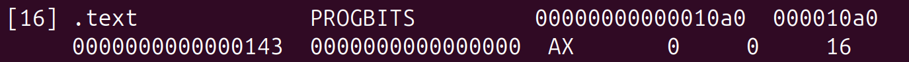
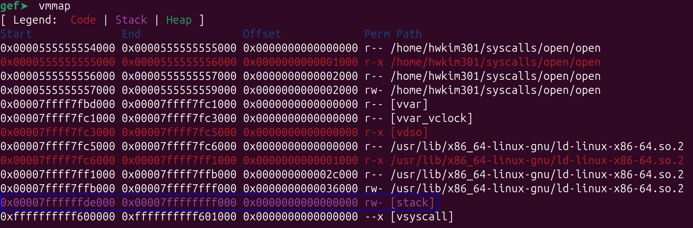

## Some Caveats 

Unlike pwn.college, where you can put all the x86-64 instructions under `_start`, when writing syscalls in the wild you need to specify the `.data` or `.text` sections. 

Someone already asked on [stackoverflow](https://stackoverflow.com/questions/7254176/why-do-we-need-to-define-data-and-text-section-in-assembly) why you would need to specify the sections for your x86-64 assembly source. 

If you don't specify the sections, you'll get an error like below.

```
$ ./open 
Illegal instruction (core dumped)
```

However, if you push the file on the stack using hexadecimals you won't need to specify the sections. 

According to [stackoverflow](https://stackoverflow.com/questions/59870800/how-is-text-segment-made-read-only), the `.text` section of an ELF file is read-only by default unless you modify the linker. 

Run `readelf` on the ELF. 

```bash 
$ readelf -a open
```

The `.text` section does not have write(w) access. 



The stack memory in Linux, seems to have read/write access.



I'm not 100% sure, but I think the reason we need to specify sections with lea is that it relies on static addresses within the ELF binary. 

Since different sections (like `.data` or `.rodata`) have different memory permissions (NX, Read-Only), the assembler and linker need to know exactly where that data resides to ensure the instruction points to a valid, accessible memory region at runtime.

On the other hand, the stack is dynamically allocated with read/write permissions at runtime, which allows us to directly push/pop data. 
