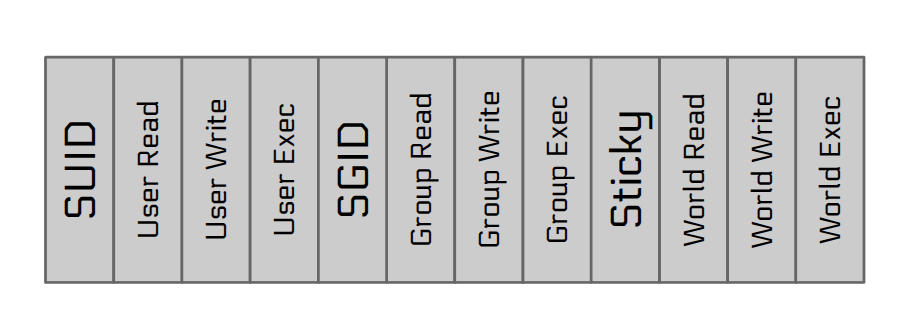
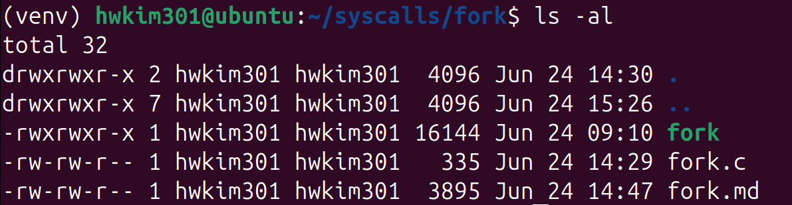
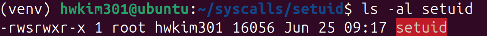
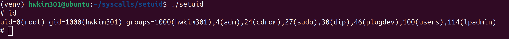
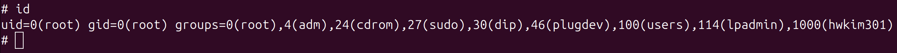

## What is setuid? 

My first encounter with `setuid` was from the program-misuse challenges in pwn.college. 

A couple of years ago, I didn't quite understand what setuid did and just copied the challenge answers online. 

For me it was one of the most bizarre syscalls in Linux.

### setuid

Before we dive into what setuid is let's first understand the user and group identifiers. 

Linux has a real user ID(UID) and real group ID(GID). 

These IDs determine who owns the process. 

A process can obtain its real user(group) ID using `getuid` abd `getgid`.

Next, there's the effective user ID(eUID) and effective group ID(eGID). 

These IDs are used by the kernel to determine the permissions when accessing files. 

A process can obtain its effective user (group) ID using `geteuid` and `getegid`.

Finally, there's the saved set-user-ID and saved set-group-ID. 

These IDs are used in set-user-ID and set-group-ID programs to save a copy of  the  corresponding  effective  IDs that were set when the program was executed.

A set-user-ID program can assume and  drop  privileges  by switching its effective user ID back and forth between the values in its real user ID and saved set-user-ID.

I got most of the definitions from the man page. 

You can check out man permissions for definitions for the permissions. 

From now on, I'll refer the real user ID ad UID, and the real group ID as GID since they're shorter. 

Here's an example code that prints the UID and GID.

```c
#include <unistd.h> 
#include <stdio.h> 

int main(){
    printf("The real user ID is %d\n",getuid());
    printf("The real group ID is %d\n",getgid());
}
```

```bash 
$ gcc ids.c -o ids
```

Compile it, and execute the ELF. 

```bash 
$ ./ids
The real user ID is 1000
The real group ID is 1000
```

Usually, the UID and GID will be equal, due to the [user private groups idiom](https://wiki.debian.org/UserPrivateGroups). 

Bash has a command called `id` that prints the UID and GID. 

```bash
$ id
uid=1000(hwkim301) gid=1000(hwkim301) groups=1000(hwkim301),4(adm),24(cdrom),27(sudo),30(dip),46(plugdev),100(users),114(lpadmin)
```

You can see that it prints the exact same number as `getuid` and `getgid`.

Generally the UID and GID are usually equal with a value of 1000.

[Here](https://unix.stackexchange.com/questions/503131/when-did-user-accounts-using-uids-above-1000-become-normal-and-why) is a reason on why UID  usually starts at 1000 or above.

Since we've learned about the user and group identifiers, now let's move on to setuid. 

[setuid](https://en.wikipedia.org/wiki/Setuid) short for set user identity, allows users to run an executable with the file system permissions of the executable's owner or group. 

Huh, what does that mean? 

I got the diagram from pwn.college, it was the only proper slide that depicts the setuid/setgid model correctly.



As we all know Linux has permissions bits to read `r`(4), write `w`(2) and  execute `x`(1) for owner, group and other.



However there's actually a bit in front of the `r`, which is the setuid bit for the user (octal 4000) and setgid bit for the group (octal 2000). 

Finally there's a [sticky bit](https://en.wikipedia.org/wiki/Sticky_bit) for others (octal 1000).

When the setuid bit is turned on for an executable file, it will execute with the eUID of the file owner than the parent process.

Just like setuid, if the setgid bit is on, it  if will execute with the eGID of the file owner rather than the parent process. 

If might be hard to understand, but if the setuid bit is turned on you'll execute the file as with the privilege of the file owner. 

Initially you might think that set user id doesn't seem impressive at all, I first thought it was really weird. 

However, setuid is very powerful, it will let you run programs with root privileges although you're just a regular user. 

For example, here's a simple C code that calls `setuid(0)` and spawn `/bin/sh`.

```c
#include <unistd.h>

int main(){
    char *argv[]={"/bin/sh",NULL};
    setuid(0);
    execve(argv[0],argv,NULL);
}
```

Linux has a strong convention of mapping root to user ID 0. 

[Here](https://superuser.com/questions/626843/does-the-root-account-always-have-uid-gid-0) is a related question on why root is user ID 0.

If we call `setuid(0)` than run `execve` we'll be able to spawn a root shell. 

Compile the code, and execute it. 

```bash
$ gcc setuid.c -o setuid
```

Unlike what I expected, you won't get a root shell. 

```
$ ./setuid 
$ id
uid=1000(hwkim301) gid=1000(hwkim301) groups=1000(hwkim301),4(adm),24(cdrom),27(sudo),30(dip),46(plugdev),100(users),114(lpadmin)
```

It's because although I haven't made any mistakes the owner of the files is still a regular user (hwkim301).

Keep it mind that the goal of a setuid executable is to run as the owner of the file. 

It will only give you different results if the file owner is different. 

Let's run some commands so that root is the owner of the file. 

```bash
sudo chown root setuid
```

```bash 
$ ls -al setuid
-rwxrwxr-x 1 hwkim301 hwkim301 16056 Jun 25 09:17 setuid
```

You can see that the owner of the file changed from hwkim301 to root. 

```bash
$ ls -al setuid
-rwxrwxr-x 1 root hwkim301 16056 Jun 25 09:17 setuid
```

However, it still doesn't pop a root shell. 

```bash 
$ ./setuid 
$ id
uid=1000(hwkim301) gid=1000(hwkim301) groups=1000(hwkim301),4(adm),24(cdrom),27(sudo),30(dip),46(plugdev),100(users),114(lpadmin)
```

It's because although we've changed the owner of the file to root, we need to enable the setuid bit to execute the file with the privilege of the file owner. 

```bash 
$ sudo chmod u+s setuid
```

You can see that the file has a red box on the filename. 



Execute the binary again and you'll get a root shell.



Root has `#` for its shell and user shells have `$` as the default symbol. 

According to [stackoverflow](https://unix.stackexchange.com/questions/291729/why-is-the-default-symbol-for-a-user-shell-and-the-default-symbol-for-a-root) it's due to tradition. 

[Here](https://unix.stackexchange.com/questions/79395/how-does-the-sticky-bit-work
) is a detailed post on how to enable setuid bit for executables. 

Finally, another example that shows the UID/GID eUID/eGID and sUID/sGID. 

```c
$ cat setuid2.c
#define _GNU_SOURCE
#include <unistd.h>
#include <stdio.h> 

int main(){

    uid_t ruid, euid, suid; 
    gid_t rgid, egid, sgid;  

    printf("Before setuid(0)\n");

    getresuid(&ruid, &euid, &suid);
    getresgid(&rgid, &egid, &sgid);

    printf("UID : %d, eUID: %d, sUID: %d\n", ruid, euid, suid);
    printf("GID : %d, eGID: %d, sGID: %d\n", rgid, egid, sgid);

    setuid(0);
    setgid(0);

    printf("After setuid(0)\n"); 

    getresuid(&ruid, &euid, &suid); 
    getresgid(&rgid, &egid, &sgid);

    printf("UID : %d, eUID: %d, sUID: %d\n", ruid, euid, suid);
    printf("GID : %d, eGID: %d, sGID: %d\n", rgid, egid, sgid);
    
    char *argv[]={"/bin/sh",NULL};
    execve(argv[0],argv,NULL);
}
```

Compile and enable the setuid/setgid bits. 

```bash 
$ gcc setuid2.c -o setuid2
$ sudo chown root setuid2
$ sudo chmod u+s setuid2
$ sudo chmod g+s setuid2
```

You can see that all the values changed. 

```bash
$ ./setuid2
Before setuid(0)
UID : 1000, eUID: 0, sUID: 0
GID : 1000, eGID: 1000, sGID: 1000
After setuid(0)
UID : 0, eUID: 0, sUID: 0
GID : 0, eGID: 0, sGID: 0
```

Now that the UID and GID are all root, it looks like a perfect root shell. 



Writing setuid in x86-64 isn't that hard unlike other syscalls. 

```
.intel_syntax noprefix
.globl _start

_start:
    mov rax, 105 
    mov rdi, 0
    syscall  # setuid(0);
    
    mov rax, 106 
    mov rdi, 0 
    syscall  # setgid(0);

    lea rdi, [rip+bin_sh]
    mov rsi, 0
    mov rdx, 0 
    mov rax, 59
    syscall  # execve("/bin/sh",0,0);

bin_sh:
    .string "/bin/sh"
```
